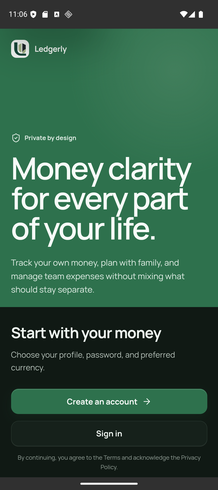
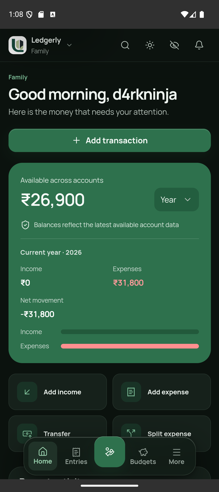
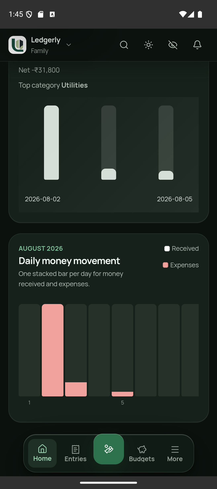
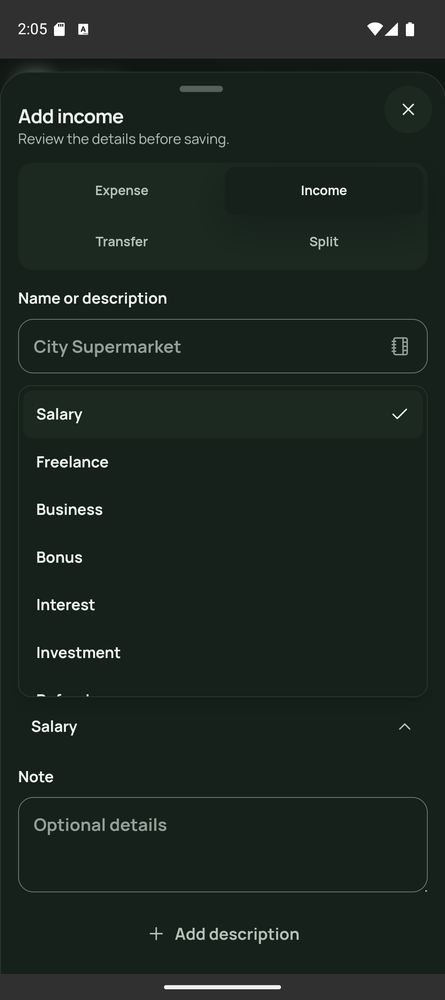
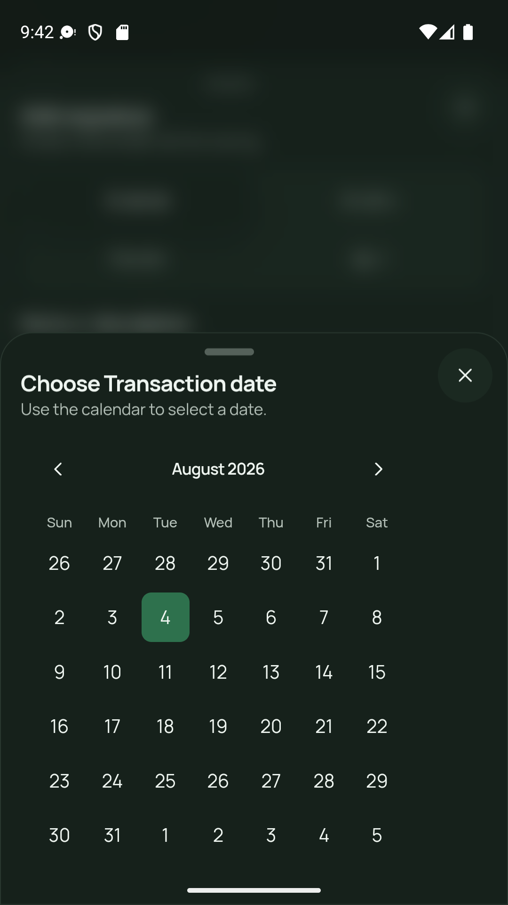
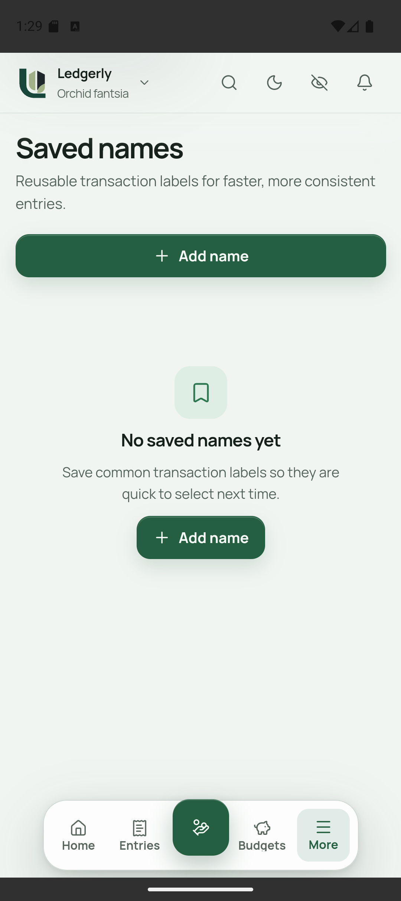

<p align="center">
  
</p>

<h1 align="center">Ledgerly</h1>

<p align="center">
  Development and Android QA guide for the Ledgerly finance platform.
</p>

## Product preview

<table>
  <tr>
    <td align="center" width="33%">
      <br />
      <sub><strong>Private-first onboarding</strong></sub>
    </td>
    <td align="center" width="33%">
      <br />
      <sub><strong>Workspace dashboard</strong></sub>
    </td>
    <td align="center" width="33%">
      <br />
      <sub><strong>Financial insights</strong></sub>
    </td>
  </tr>
  <tr>
    <td align="center" width="33%">
      <br />
      <sub><strong>Categorized entries</strong></sub>
    </td>
    <td align="center" width="33%">
      <br />
      <sub><strong>Transaction dates</strong></sub>
    </td>
    <td align="center" width="33%">
      <br />
      <sub><strong>Reusable transaction names</strong></sub>
    </td>
  </tr>
</table>

## Canonical reusable test account

Use this one fixed account for local web and Android testing:

- Email: `ananya@example.test`
- Password: `MoneyTracking!2026`
- Android app PIN: `246810`
- Currency: `INR`

Do not register a new account for routine QA. The development seed uses fixed
IDs, so rerunning it is idempotent: it restores/keeps the same deterministic
fixtures instead of creating a new random test user each time. The seed also
contains fixed collaborator records required for family/office permission
scenarios; `ananya@example.test` is the canonical interactive login.

## Local backend for the Android emulator

Ledgerly requires a MongoDB replica set because financial writes are
transactional. Start the API with `APP_ENV=development`, MongoDB configured as a
replica set, and port `8080`. Seed once (or safely rerun) from `api`:

```powershell
$env:APP_ENV = 'development'
$env:MONGO_URI = 'mongodb://127.0.0.1:27018/?replicaSet=rs0'
$env:MONGO_DB = 'moneytracking'
go run ./cmd/seed
```

For an emulator build, use the host bridge rather than `localhost`:

```powershell
cd web
$env:VITE_API_BASE_URL = 'http://10.0.2.2:8080/api/v1'
npm run android:run -- --target emulator-5554
```

Confirm the backend before testing with `http://127.0.0.1:8080/ready`. A
physical Android device needs either `adb reverse tcp:8080 tcp:8080` plus an
app build configured for that route, or a backend URL reachable from the
device; `10.0.2.2` is emulator-only.

## Basic smoke test

1. Launch Ledgerly and choose **Sign in**.
2. Use the canonical credentials above.
3. On a clean Android install, set the app PIN to `246810`.
4. Verify the Family dashboard loads without an error banner.
5. Open Entries, Budgets, Goals, and More; confirm each screen loads.
6. Create a small test transaction and confirm balances/dashboard update.
7. Relaunch the app and verify the PIN unlock flow.
