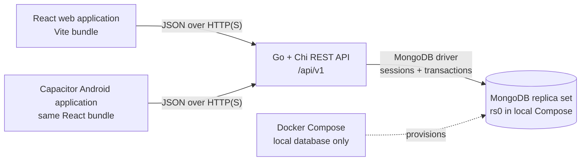

<p align="center">
  
</p>

<h1 align="center">Ledgerly</h1>

<p align="center">
  A shared finance platform for tracking money, planning goals, and coordinating financial activity across web and Android.
</p>

<p align="center">
  <a href="https://github.com/d4rkNinja/ledgerly-app/actions/workflows/secret-scan.yml"></a>
  <a href="LICENSE"></a>
  
  
  
  
</p>

Ledgerly combines a Go REST API, a responsive React application, and a
Capacitor Android shell in one monorepo. It supports personal, family, and
office-style workspaces; records financial activity; and keeps collaboration,
permissions, reporting, and audit history behind authenticated workspace
boundaries.

> [!IMPORTANT]
> **Repository access:** the GitHub repository is currently private, so cloning
> requires authorized access. The checked-in Ledgerly source is licensed under
> the [MIT License](LICENSE); repository visibility and licensing are separate
> concerns.

## Why Ledgerly exists

Ledgerly is both a finance application and a specification-driven engineering
experiment. The initial build tested whether detailed technical specifications,
reusable engineering skills, established development conventions, and a
structured validation harness could guide implementation from mostly
high-level, task-sized instructions.

The repository preserves feature specifications, implementation plans, source,
and automated tests. It does **not** contain a complete recording or transcript
of every development prompt, so workflow and timing statements should be read
as creator-reported context rather than independently measured benchmarks.

### About the approximately two-hour experiment

The approximately two-hour figure represents the **initial application
implementation session after the reusable engineering harness and skills
already existed**. It does not include the prior work required to design and
refine:

- the engineering harness;
- reusable internal skills;
- development and review conventions;
- testing and verification workflows; or
- the broader technical methodology.

The claim is not a general productivity benchmark and does not mean a production
system can be designed from scratch in two hours. The useful artifact is the
repository itself: reviewers can inspect the implementation, tests, decisions,
and known boundaries directly.

## Features

### Finance

- Categorized income, expense, transfer, and split entries with contacts, notes,
  privacy controls, and idempotent writes.
- User-selected transaction occurrence dates that feed monthly dashboards,
  daily cash-flow views, filters, and reports.
- Searchable reusable transaction names that can be created, renamed, and
  deleted for faster, consistent entry.
- Accounts and vault-backed balances, opening balances, account editing,
  sharing, and archival that retains historical ledger records.
- Monthly dashboards, daily cash-flow detail, category summaries, report
  summaries, search, and workspace CSV export.
- Budgets with periods, categories, rollover settings, progress, record
  actions, and workspace sharing.
- Financial goals with progress, linked transactions, completion, cancellation,
  reopening, and rescheduling flows.
- Recurring bill visibility and reusable contacts.

### Collaboration

- Personal, family, and office workspaces.
- Owner, administrator, finance manager, approver, member, and viewer roles,
  plus explicit permissions enforced by the API.
- Direct invitations, reusable workspace join codes, approval-based join
  requests, member role changes, and member removal.
- Expense claim submission and review, notifications, creator attribution, and
  workspace audit history.

### Applications

- Responsive React web client with light/dark themes, keyboard-accessible
  surfaces, loading/error/empty states, and animated interaction feedback.
- Capacitor Android application built from the same React bundle, with native
  preferences, app lifecycle/back handling, network state, haptics, keyboard,
  splash screen, and an optional local app PIN.
- Go/Chi JSON API backed by MongoDB transactions, indexes, sessions, CORS,
  request limits, and graceful shutdown.

## Architecture



The browser and Android application use the same API client and React feature
modules. The Android project is a native Capacitor container, not a separate
React Native codebase. The API owns authentication, authorization, validation,
workspace isolation, financial effects, and persistence. MongoDB must support
logical sessions and transactions, which is why local Compose runs a replica
set.

## Technology stack

| Layer | Technology |
| --- | --- |
| Backend | Go 1.22, Chi 5.2, MongoDB Go Driver 1.17 |
| Database | MongoDB 7 with replica-set transactions |
| Web | React 19, React Router 8, TypeScript 5.9, Vite 8 |
| UI and state | Tailwind CSS 4, TanStack Query 5, React Hook Form, Zod 4, Motion |
| Android | Capacitor 8.4, Gradle 8.14, Android Gradle Plugin 8.13, SDK 36 |
| Testing | Go test, Vitest, Testing Library, Node test runner, Android Lint/JUnit |
| Local infrastructure | Docker Compose for MongoDB only |
| CI | GitHub Actions secret scanning with Gitleaks |

## Repository structure

```text
ledgerly-app/
├── .github/
│   └── workflows/            GitHub Actions workflows
├── api/                      Go API, MongoDB configuration, seed, and Compose
├── applications/
│   └── android/              Capacitor Android project, native overlay, and tooling
├── docs/                     Feature specs, implementation plans, and screenshots
├── web/                      React/Vite application and Android npm entry points
├── .gitignore
└── README.md
```

There is no root package manager, Makefile, or full-stack Compose file. Run
backend and frontend commands from their service directories.

## Getting started

### Prerequisites

| Requirement | Version or purpose |
| --- | --- |
| Git | Clone and contribute |
| Go | 1.22 or newer |
| Node.js | `^22.22.0 || >=24.0.0` |
| npm | 10 or newer; the repository records npm 11.8 |
| MongoDB | A deployment with replica-set transaction support |
| Docker + Compose | Recommended for the local MongoDB service |
| JDK | JDK 21, only for Android work |
| Android SDK | Platform 36, Build Tools 36.0.0, and `adb`, only for Android work |

Android Studio is optional for command-line builds and useful for emulator,
device, and native-project work. This repository does not contain an iOS
project.

### Clone the repository

```bash
git clone https://github.com/d4rkNinja/ledgerly-app.git
cd ledgerly-app
```

SSH:

```bash
git clone git@github.com:d4rkNinja/ledgerly-app.git
cd ledgerly-app
```

Because the repository is currently private, cloning requires authorized GitHub
access.

### Environment configuration

#### API

`api/.env.example` is the source-controlled configuration template. The Go
binaries read **process environment variables**; they do not load `.env`
automatically.

| Variable | Development default | Purpose |
| --- | --- | --- |
| `APP_ENV` | `development` | Required explicitly; accepts `development`, `test`, `staging`, or `production` |
| `SERVER_HOST` | `0.0.0.0` | API bind host |
| `SERVER_PORT` | `8080` | API port |
| `MONGO_URI` | `mongodb://localhost:27017/?replicaSet=rs0` | MongoDB replica-set or sharded-cluster URI |
| `MONGO_DB` | `moneytracking` | Database name |
| `CORS_ALLOWED_ORIGINS` | Localhost web origins | Comma-separated browser origins |
| `SESSION_TTL` | `720h` | Session lifetime |
| `MAX_BODY_BYTES` | `1048576` | Maximum request body |
| `MAX_HEADER_BYTES` | `1048576` | Maximum request headers |
| `READ_HEADER_TIMEOUT` | `5s` | Header-read timeout |
| `READ_TIMEOUT` | `10s` | Request-read timeout |
| `WRITE_TIMEOUT` | `35s` | Response-write timeout |
| `IDLE_TIMEOUT` | `60s` | Keep-alive idle timeout |
| `REQUEST_TIMEOUT` | `30s` | Router request deadline |
| `SHUTDOWN_TIMEOUT` | `10s` | Graceful shutdown deadline |
| `TRUSTED_PROXIES` | Empty | Comma-separated proxy IPs/CIDRs trusted for forwarded client IPs |

Staging and production require explicit, non-empty `MONGO_URI` and
`CORS_ALLOWED_ORIGINS` values. Copy the template, then load it into the shell
before running either API command:

```bash
cp api/.env.example api/.env
cd api
set -a
. ./.env
set +a
```

PowerShell equivalent:

```powershell
Copy-Item api/.env.example api/.env
Set-Location api
Get-Content .env |
  Where-Object { $_ -match '^[A-Z_][A-Z0-9_]*=' } |
  ForEach-Object {
    $name, $value = $_ -split '=', 2
    Set-Item -Path "Env:$name" -Value $value
  }
```

#### Web

Create `web/.env.local` for local browser development:

```dotenv
VITE_API_BASE_URL=/api/v1
VITE_API_PROXY_TARGET=http://127.0.0.1:8080
VITE_PUBLIC_APP_URL=http://localhost:5173
```

| Variable | Purpose |
| --- | --- |
| `VITE_API_BASE_URL` | API prefix or absolute API URL used by the client |
| `VITE_API_PROXY_TARGET` | Vite development proxy target for `/api/v1` |
| `VITE_PUBLIC_APP_URL` | Optional public base used to create invitation share links |

Set `VITE_API_BASE_URL` explicitly. Without it, the current client falls back
to a deployed API endpoint rather than the local Vite proxy.

## Run with Docker

The checked-in Compose file starts **MongoDB only**. The API and web application
still run on the host.

```bash
cd api
docker compose up -d
docker compose ps
```

Wait until `mongo` is healthy and `mongo-init` has exited successfully. The
database listens on `127.0.0.1:27017`, initiates replica set `rs0`, and
persists data in the named `mongo-data` volume.

```bash
docker compose logs -f mongo
```

Stop the containers without deleting the persistent volume:

```bash
docker compose down
```

There are no API or web Dockerfiles and no production Compose stack in this
repository.

## Run the applications

### Backend API

With the API environment loaded and MongoDB ready:

```bash
cd api
go mod download
go run ./cmd/seed
go run ./cmd/api
```

The seed command is development-only and idempotently creates deterministic
fixtures. The reusable development login is:

```text
Email:    ananya@example.test
Password: MoneyTracking!2026
```

The API starts on `http://localhost:8080` with the example configuration.

### Web application

In a second terminal:

```bash
cd web
npm ci
npm run dev
```

Open `http://localhost:5173`. API requests under `/api/v1` are proxied to
`http://127.0.0.1:8080` by the local Vite configuration.

### Android application

Run these commands from `web/`. Keep the emulator API URL exported for the
entire shell session; `10.0.2.2` is the Android emulator bridge to the host.

```bash
cd web
export VITE_API_BASE_URL=http://10.0.2.2:8080/api/v1
npm run android:doctor
npm run android:setup
npm run android:run
```

PowerShell:

```powershell
Set-Location web
$env:VITE_API_BASE_URL = 'http://10.0.2.2:8080/api/v1'
npm run android:doctor
npm run android:setup
npm run android:run
```

`android:setup` performs a clean npm install, runs the script contracts and
web checks, synchronizes Capacitor, validates Gradle dependencies, runs Android
unit tests and lint, and builds a debug APK. `android:run` rebuilds, installs,
and launches the APK through `adb`. To target a specific device:

```bash
npm run android:run -- --target emulator-5554
```

A physical device needs an API URL reachable from that device; the emulator-only
`10.0.2.2` address will not work.

## Development

### Commands

| Directory | Command | Purpose |
| --- | --- | --- |
| `api/` | `go run ./cmd/api` | Start the API |
| `api/` | `go run ./cmd/seed` | Seed deterministic development data |
| `api/` | `go test ./...` | Run backend tests |
| `api/` | `go vet ./...` | Run Go static analysis |
| `api/` | `go build ./...` | Build all Go packages |
| `api/` | `gofmt -l cmd internal` | List unformatted Go files |
| `web/` | `npm run dev` | Start Vite |
| `web/` | `npm run test:run` | Run Vitest once |
| `web/` | `npm run typecheck` | Run TypeScript checks |
| `web/` | `npm run lint` | Run Oxlint on `src` |
| `web/` | `npm run build` | Build `web/dist` |
| `web/` | `npm run check` | Test, type-check, lint, and build |
| `web/` | `npm run test:scripts` | Test Android orchestration scripts |
| `web/` | `npm run android:test` | Run Gradle dependency, unit-test, and lint checks |
| `web/` | `npm run android:build:debug` | Build the debug APK |
| `web/` | `npm run android:build:release` | Build the current release APK |

There is no single root-level test command. A full local verification is:
`go test ./...`, `go vet ./...`, and `go build ./...` from `api/`, followed
by `npm run check`, `npm run test:scripts`, and `npm run android:test` from
`web/`.

The repository has no dedicated web formatter script. Go contributors can
apply formatting with `gofmt -w cmd internal` from `api/`.

### Production builds

Backend:

```bash
cd api
go build -o bin/ledgerly-api ./cmd/api
```

Web:

```bash
cd web
npm ci
VITE_API_BASE_URL=https://api.example.com/api/v1 npm run build
```

The static output is written to `web/dist/`.

Android release candidate:

```bash
cd web
export VITE_API_BASE_URL=https://api.example.com/api/v1
npm run android:build:release
```

The APK is written to
`applications/android/app/build/outputs/apk/release/app-release.apk`.
The current `release` variant uses the debug signing configuration and has
minification disabled. Configure owner-controlled release signing and complete
device/store validation before treating the artifact as production or
Play-ready.

## Deployment

Ledgerly does not include a production Docker stack or a turnkey deployment
script. A manual deployment needs:

1. A MongoDB replica set or sharded cluster that supports transactions.
2. The compiled Go API running under an operating-system service or process
   manager with explicit production environment variables.
3. TLS termination and a reverse proxy in front of the API.
4. `CORS_ALLOWED_ORIGINS` restricted to the deployed web origin.
5. The contents of `web/dist/` served by a static host with SPA fallback to
   `index.html`.
6. Backups, monitoring, log collection, secret management, and a rollback
   procedure supplied by the deployment environment.

Build the web client with the final HTTPS API URL; Vite variables are embedded
at build time. The in-process API rate limiter is per instance, so a
multi-instance deployment needs an external/distributed rate-limiting strategy.

### Health checks

| Endpoint | Meaning |
| --- | --- |
| `GET /health` | Liveness; returns `{"status":"ok"}` when the API process can serve requests |
| `GET /ready` | Readiness; pings MongoDB and returns `{"status":"ready"}` only when the database is reachable |

Local examples:

```bash
curl http://localhost:8080/health
curl http://localhost:8080/ready
```

## API overview

- Local API origin: `http://localhost:8080`
- REST base path: `/api/v1`
- Authentication: email/password login returns an opaque bearer token; protected
  requests use `Authorization: Bearer <token>`.
- Public groups: registration and login.
- Protected groups: profile and sessions, workspaces, invitations and join
  requests, notifications, dashboard, search, reports, audit, vaults, accounts,
  transactions, contacts, saved names, budgets, bills, goals, members, and
  expense claims.
- Lists that support pagination use validated `limit` and `skip` query
  parameters; finance lists also expose scoped filters.
- Errors are JSON objects with stable error codes, messages, optional field
  errors, and request IDs.
- Transaction and selected goal write operations require an
  `Idempotency-Key` header.

There is currently no OpenAPI/Swagger document or interactive API console.
See [the backend reference](api/README.md) and the
[registered routes](api/internal/router/router.go) for deeper implementation
detail. Use this root README—not the backend document's older directory
examples—for monorepo setup commands.

## Documentation

| Document | Contents |
| --- | --- |
| [Backend reference](api/README.md) | Domain model, endpoint groups, indexes, security, and scope boundaries |
| [Finance dates, dashboards, and goals](docs/finance-date-dashboard-goals-implementation.md) | Implemented date, aggregation, goal, and verification contracts |
| [Shared workspace design](docs/superpowers/specs/2026-08-02-shared-workspace-product-completion-design.md) | Invitations, members, dashboard, export, and workspace boundaries |
| [Finance record actions and mobile dashboard](docs/superpowers/specs/2026-08-03-finance-record-actions-mobile-dashboard-design.md) | Record actions, monthly dashboard, responsive behavior, and tests |
| [Data deletion design](docs/superpowers/specs/2026-08-01-data-deletion-design.md) | Workspace/account deletion contracts |
| [Workspace access design](docs/superpowers/specs/2026-08-01-workspace-access-design.md) | Invitation and join-request behavior |
| [Android application design](applications/android/docs/superpowers/specs/2026-07-30-capacitor-android-app-design.md) | Capacitor architecture, automation, native policy, and validation |
| [App PIN design](web/docs/superpowers/specs/2026-08-01-single-entry-app-pin-design.md) | Local six-digit PIN behavior and tests |
| [Engineering showcase design](docs/superpowers/specs/2026-08-02-remotion-engineering-showcase-design.md) | Creator-reported experiment narrative and evidence-integrity rules |

The repository does not contain one canonical, end-to-end original application
specification or a dedicated `docs/experiment/` directory. It does preserve
the feature specifications and plans above, which allow reviewers to compare
many intended contracts with their implementation.

## Security

Implemented controls include PBKDF2-HMAC-SHA256 password hashing with 210,000
iterations, hashed opaque session and invitation tokens, TTL indexes, API
authorization and workspace isolation, role/permission checks, request limits,
explicit CORS, audited mutations, and MongoDB transactions for multi-record
financial effects. GitHub Actions runs Gitleaks against the repository history.

Never commit:

- `.env` files or production configuration;
- passwords, tokens, session values, or invitation secrets;
- private keys, certificates, keystores, or signing credentials;
- cloud/service-account credentials; or
- production database URLs.

There is no `SECURITY.md` or documented vulnerability-reporting channel yet.
Do not publish a suspected vulnerability or secret in a public issue; contact
the maintainers privately before disclosure.

## Contributing

The repository does not yet include `CONTRIBUTING.md` or a code of conduct.
With repository access, the expected workflow is:

1. Fork or branch from `main`.
2. Keep the change focused and add tests for observable behavior.
3. Run the backend, web, and Android checks affected by the change.
4. Open a pull request describing behavior, risk, and verification evidence.

External forks and pull requests may not be available while the repository
remains private.

## License

Ledgerly is licensed under the [MIT License](LICENSE).

Copyright © 2026 d4rkninja. The license permits use, copying, modification,
merging, publication, distribution, sublicensing, and sale of the software,
subject to preserving the copyright and license notice. The software is
provided without warranty; see `LICENSE` for the complete terms.

## DarkNinjaSolutions

Ledgerly's original engineering experiment used an internal engineering harness
and reusable development skills created by
[DarkNinjaSolutions](https://darkninjasolutions.com).

The checked-in Ledgerly source is licensed under the
[MIT License](LICENSE). That license does not cover the internal engineering
harness or proprietary reusable skills unless they are separately published
under their own license.
